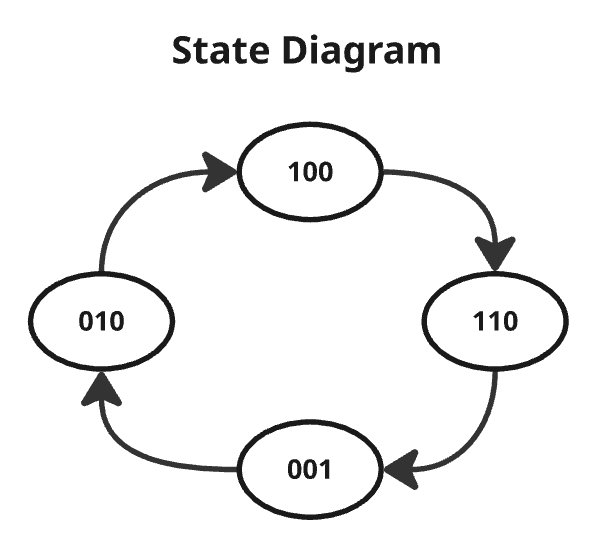
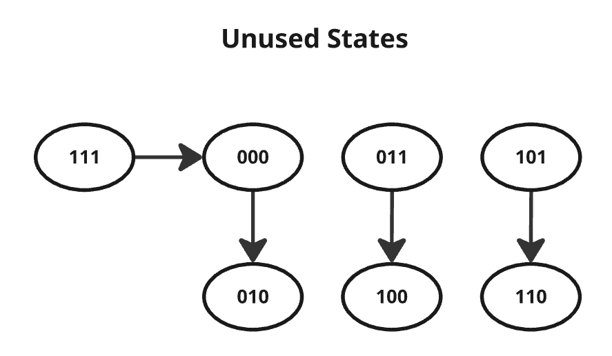
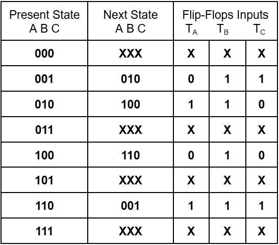
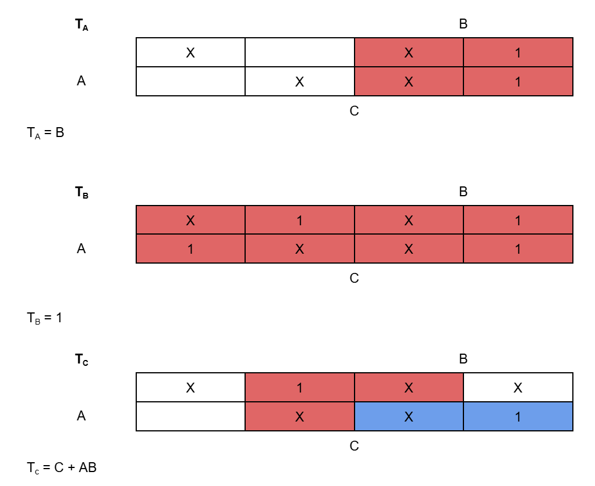
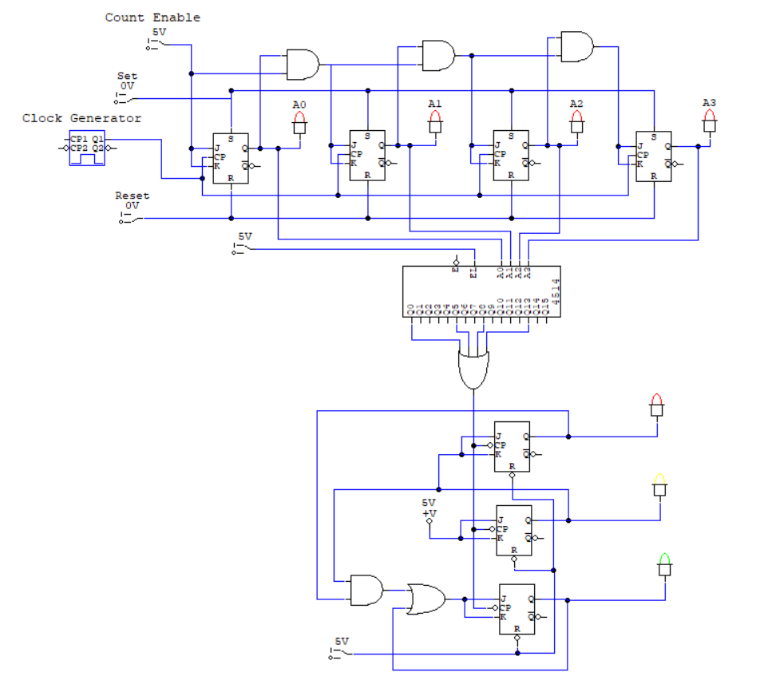
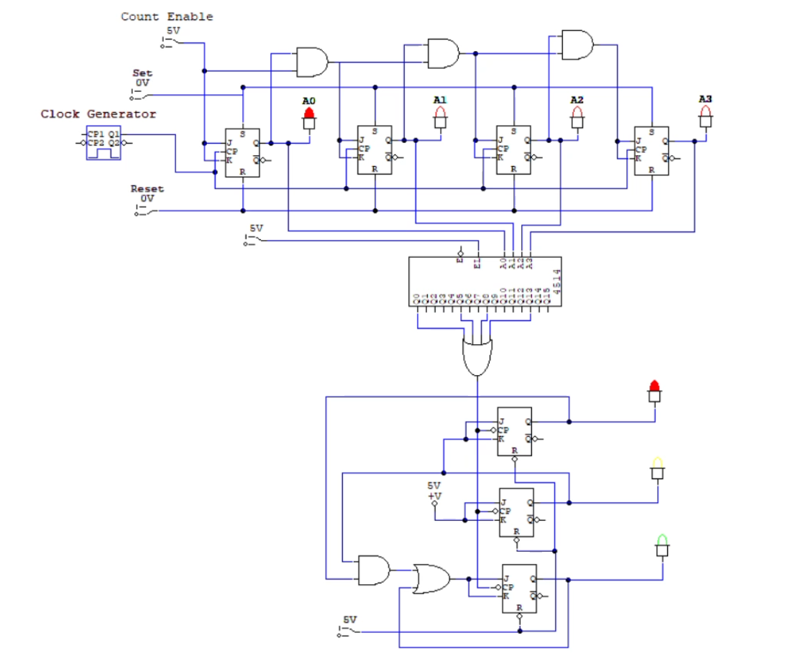
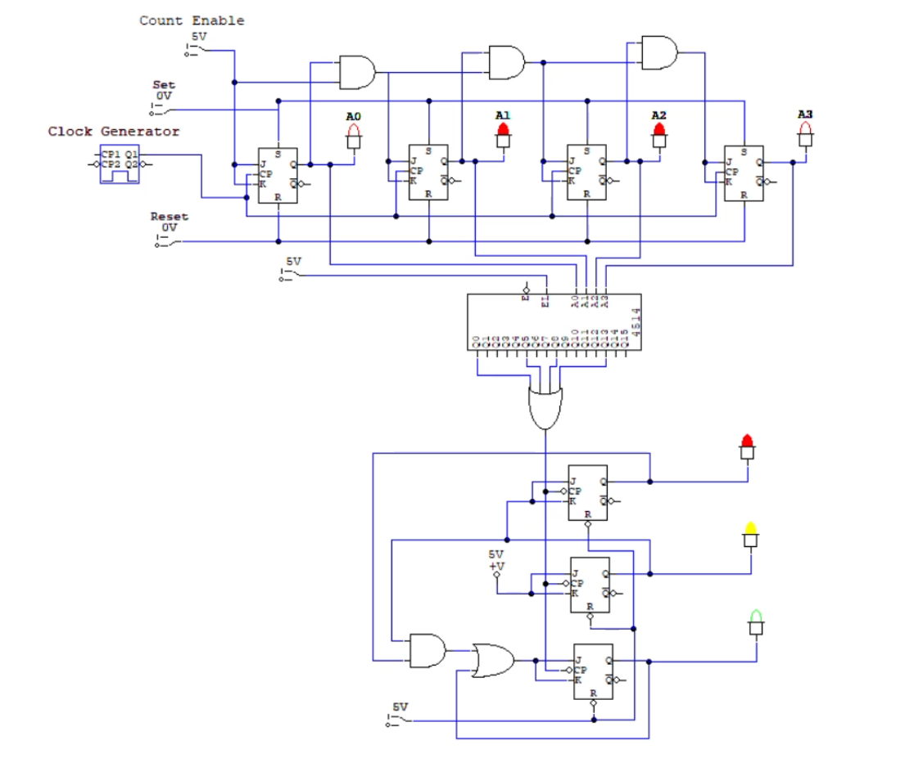
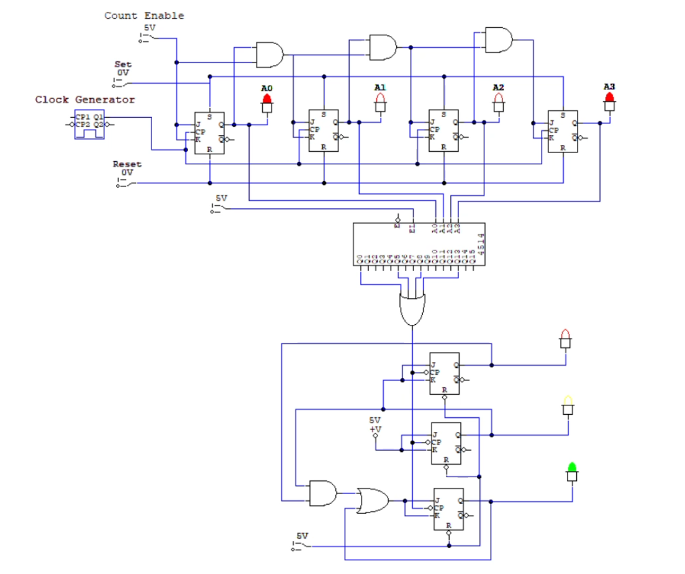
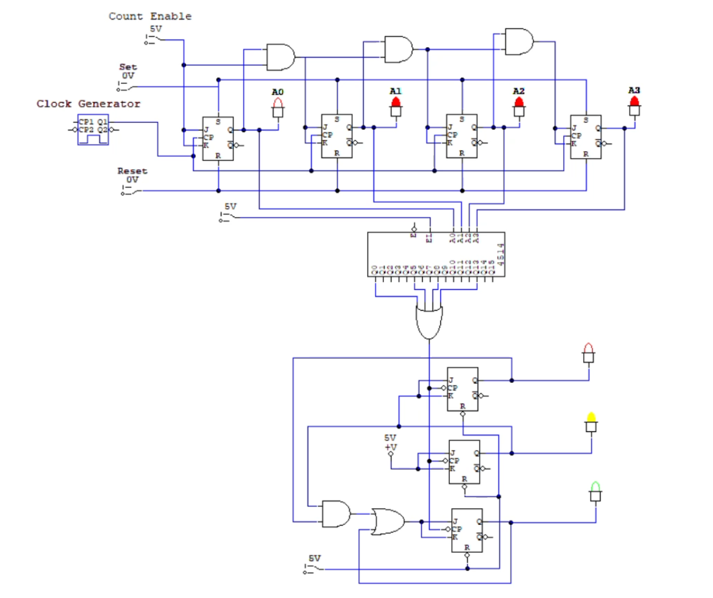

# Traffic Light Controller Using Logic Design

This project presents a complete traffic light controller design using sequential logic design principles.

The design process starts from the state diagram, then the state table, flip-flop input derivation, Karnaugh map minimization, unused states recovery, and finally the complete circuit implementation using CircuitMaker.

---

## Project Overview

The traffic light controller is designed using:

- State diagram
- State table
- Flip-flop input table
- Karnaugh maps minimization
- Unused states recovery
- JK flip-flops configured as T flip-flops
- 4-bit binary counter
- 4-to-16 decoder
- Logic gates
- Traffic light output circuit

The main traffic light states are represented using three output bits:

| State | Traffic Light Output |
|---|---|
| 100 | Red |
| 110 | Red + Yellow |
| 001 | Green |
| 010 | Yellow |

The main state sequence is:

```text
100 → 110 → 001 → 010 → 100
```

---

## Design Procedure

The design was completed using the following steps:

1. Define the required traffic light states.
2. Draw the main state diagram.
3. Identify the unused states.
4. Define how unused states recover back to valid used states.
5. Build the state table.
6. Determine the required flip-flop inputs.
7. Use Karnaugh maps to minimize the flip-flop input equations.
8. Implement the final circuit using JK flip-flops configured as T flip-flops.
9. Use a 4-bit binary counter and a 4-to-16 decoder to control the duration of each traffic light state.
10. Test the final traffic light operation.

---

## State Diagram

The following image shows the main state diagram of the traffic light controller.

It explains the normal sequence of the four used states:

```text
100 → 110 → 001 → 010 → 100
```



---

## Unused States Recovery

In this design, only four states are used in the normal traffic light sequence:

```text
100 → 110 → 001 → 010 → 100
```

The remaining states are unused states:

```text
000, 011, 101, 111
```

These unused states are treated as don't-care states during the Karnaugh map minimization process.

However, the design also includes a recovery path for the unused states. This makes the circuit more reliable and self-correcting. If the circuit enters an unused state because of reset behavior, noise, or any unexpected condition, it can return back to the normal traffic light sequence instead of staying in an undefined state.

The following image shows how the unused states return back to valid used states.



---

## State Table and Flip-Flop Inputs

The state table shows the present state, next state, and the required flip-flop inputs.

The flip-flop inputs are represented as:

```text
TA, TB, TC
```

The circuit uses JK flip-flops configured as T flip-flops, where:

```text
J = K = T
```

The following image shows the state table and the required flip-flop inputs.



---

## Karnaugh Maps Minimization

Karnaugh maps were used to simplify the flip-flop input equations.

The minimized equations are:

```text
TA = B
TB = 1
TC = C + AB
```

The following image shows the Karnaugh maps used to minimize the flip-flop input equations.



---

## Counter and Decoder Operation

A 4-bit binary counter is used to count from 0 to 15.

The counter outputs are connected to a 4-to-16 decoder. The decoder outputs are used to generate trigger signals for the traffic light state circuit.

The decoder outputs used for state transitions are:

```text
D0, D5, D8, D13
```

These decoder outputs are connected through an OR gate to generate the clock pulse for the traffic light circuit.

The count allocation is:

| Counter Range | Traffic Light State | Output State | Number of Counts |
|---|---|---|---:|
| 0 - 4 | Red | 100 | 5 |
| 5 - 7 | Red + Yellow | 110 | 3 |
| 8 - 12 | Green | 001 | 5 |
| 13 - 15 | Yellow | 010 | 3 |

The total number of counts is:

```text
5 + 3 + 5 + 3 = 16 counts
```

This matches the full range of the 4-bit binary counter:

```text
0000 to 1111
```

---

## Final Circuit Design

The final circuit was implemented using CircuitMaker.

The circuit includes:

- JK flip-flops configured as T flip-flops
- 4-bit binary counter
- 4-to-16 decoder
- OR gate for transition clock generation
- Logic gates for flip-flop input equations
- Traffic light output indicators

The following image shows the final circuit design implemented in CircuitMaker.



---

## Operation Screenshots

The following screenshots show the four main output states of the traffic light controller during operation.

### Red State



### Red and Yellow State



### Green State



### Yellow State



---

## Demo Video

The project demo video is available here:

[Traffic Light Demo Video](demo/traffic_light_demo.mp4)

---

## Project Structure

```text
Traffic-Light-Controller-Logic-Design/
├── README.md
├── images/
│   ├── state_diagram.png
│   ├── unused_states_recovery.png
│   ├── state_table.png
│   ├── kmap_minimization.png
│   ├── circuit_design.png
│   ├── red_state.png
│   ├── red_yellow_state.png
│   ├── green_state.png
│   └── yellow_state.png
└── demo/
    └── traffic_light_demo.mp4
```

---

## Tools Used

- CircuitMaker for circuit implementation and simulation
- Miro for drawing and organizing the design diagrams
- Karnaugh maps for logic minimization
- GitHub for project documentation and sharing

---

## Course Information

Course: Digital Systems Design  
Project Date: May 2025  
Project Type: Logic Design Course Project

---

## Author

This project was completed as part of the Digital Systems Design course in May 2025.

Created by: Zaid Qabaja
